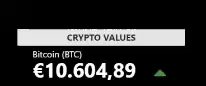

# Crypto Rates Widget

This plugin gets the price of Bitcoin, Etherium and LiteCoin in USD, GBP and EUR on a set interval.

Wanna change the refresh rate? Simply change the milliseconds in the JS. Note in this initial version, you have to change several intervals - sorry.

