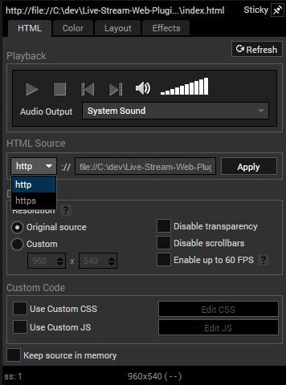
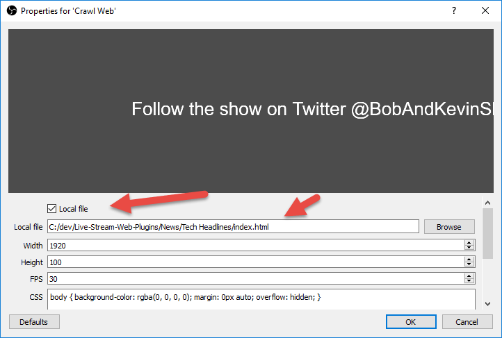

# Live Stream Web Plugins

This repo contains free easy-to-use plugins that can enhance your Live Streaming production. These plugins get used on our live YouTube show which can be found [here](https://www.youtube.com/watch?v=1gnFUAa89ns) for some great plugin preview goodness.

## What can you do?

For a video demo, watch [this](https://www.youtube.com/watch?v=ZMJpKGmxdB0)!

Let's say you want to add a crawler to the bottom of your page but want it plugged into a news feed rather than type it in. Use [this](https://github.com/kgiszewski/Live-Stream-Web-Plugins/tree/master/News/Tech%20Headlines) plugin to pull that off. It will look something like this:

Each plugin is a tiny webpage powered with CSS, Javascript and HTML. 

A few more to look at:

Don't like the styles, change them locally.

Want to integrate with a different feed? Alter it.

## Want to contribute?

Send a PR to this repo for either changes to existing plugins or brand new ones. I would prefer not to get pretty much the same plugin with different styles, please only send meaningful updates. Please provide a thumbnail and a README.md for new plugins.

## Install - OBS and XSplit

Download the whole repo or just what you want. 

All of these plugins work with OBS and XSplit since they just use the browser view in each respective app. 

With XSplit drag the `index.html` file of the plugin onto a scene. If you try to add it through the dialog, it'll not let you set `file://` as the protocol. You of course can host it on the web too.

With OBS you can host locally on a computer (easiest) or place on a web server.

Move the plugin on the screen to the desired spot. Enjoy.

## Browse the plugins

Each plugin has a README and a thumbnail, browse the repo to discover more.

## Custom plugins

Not seeing what you want? Reach out by creating an issue (above on the toolbar) and just maybe it might get created.
